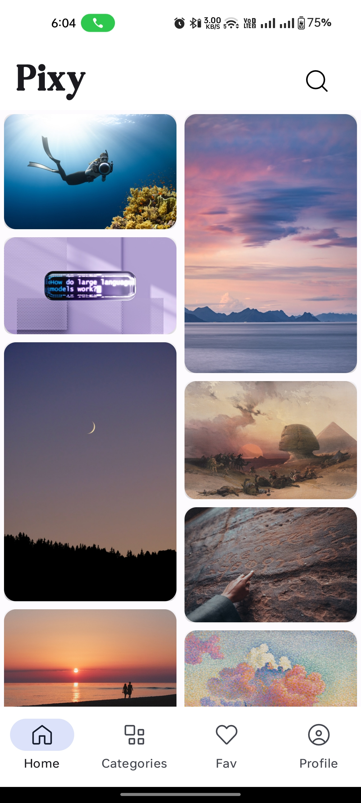
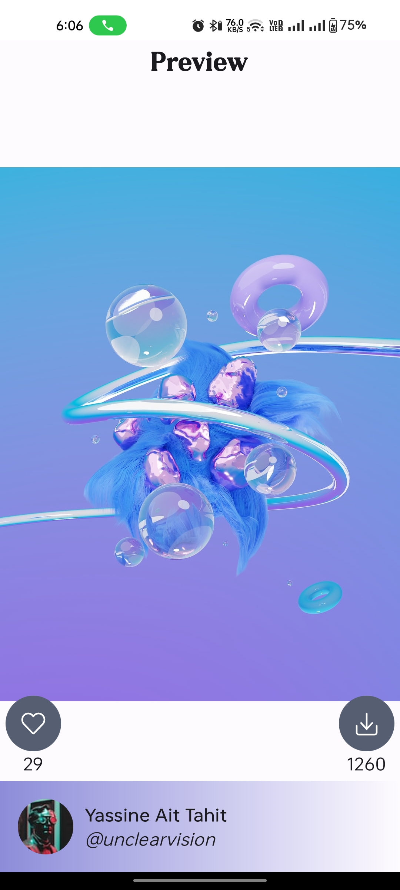
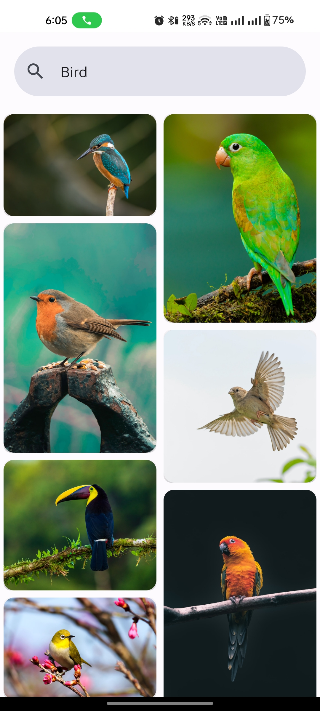
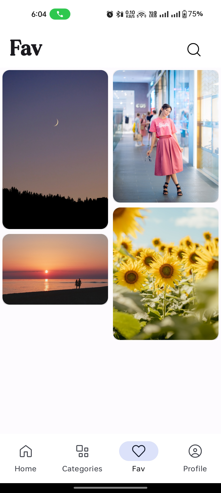
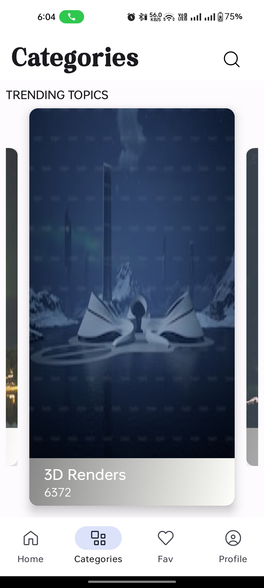

# Pixy

Stoke image application that fetched data from [Unsplash API](https://unsplash.com/developers).

## Tech Stack & Libraries

- Jetpack
    - [Compose](https://developer.android.com/jetpack/compose): A recommended modern toolkit for
      building native UI.
    - [ViewModel](https://developer.android.com/topic/libraries/architecture/viewmodel): A business
      logic or screen level state holder.
    - [Room](https://developer.android.com/training/data-storage/room): An abstraction layer over
      SQLite to allow fluent database access
    - [Navigation](https://developer.android.com/jetpack/compose/navigation): For navigating screens
      and [Hilt Navigation Compose]
    - [Paging 3](https://developer.android.com/topic/libraries/architecture/paging/v3-overview):
      Helps you load and display pages of data from a larger dataset from local storage or over
      network.
- [Coroutines](https://developer.android.com/kotlin/coroutines)
  with [Flow](https://developer.android.com/kotlin/flow) for asynchronous.
- [Dagger Hilt](https://dagger.dev/hilt/) for dependency injection.
- [Retrofit](https://square.github.io/retrofit/) for networking.
- [Gson](https://github.com/google/gson) for serialisation.
- [Coil](https://github.com/coil-kt/coil): An image loading library for Android backed by Kotlin
  Coroutines.

## Architecture

The app follows
the [official architecture guidance](https://developer.android.com/topic/architecture) for Android
apps.

## API Key

Create an account on [Unsplash](https://unsplash.com/developers) obtain the secret keys then you can
set them in ```~/apikey.properties``` to access the API.

```
ACCESS_KEY = 'Your Access Key'
SECRET_KEY = 'Your Secret Key'
```

## Screenshots

|                           Home                           |                            Detail                             |                            Search                            |
|:--------------------------------------------------------:|:-------------------------------------------------------------:|:------------------------------------------------------------:|
|  |  |  |

| Favourite                                                          | Categories                                                           |
|--------------------------------------------------------------------|----------------------------------------------------------------------|
|  |  |

## License

```
GNU General Public License v3.0
```